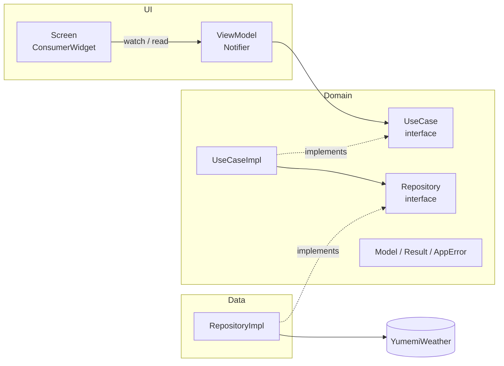
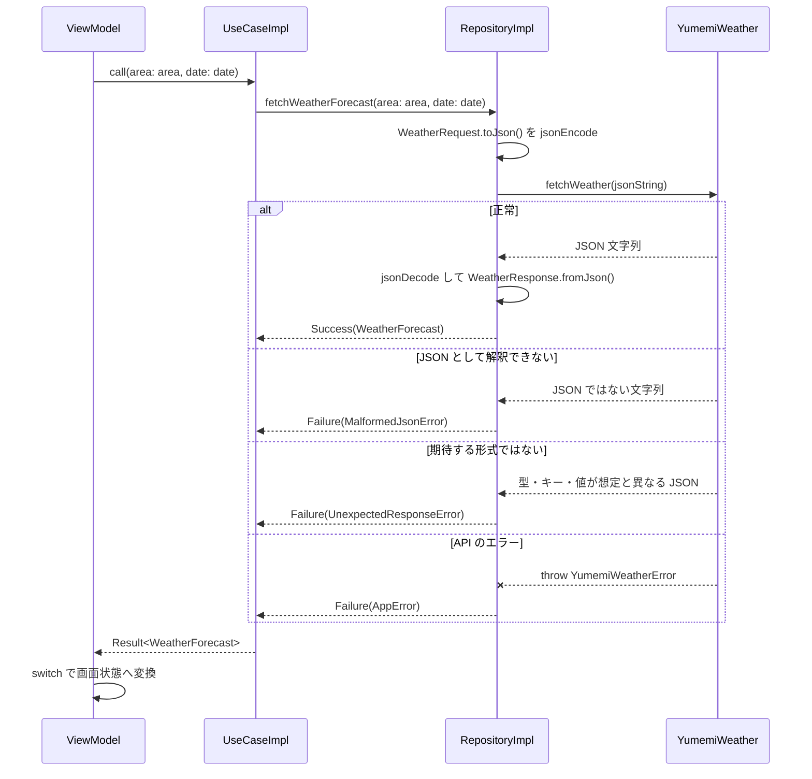

# ARCHITECTURE

本プロジェクトのアーキテクチャ（レイヤー構成・依存方向・状態管理・エラーハンドリング・テスト方針）をまとめる。新しい機能を追加するときやレビューするときは、このドキュメントに沿っているかを確認する。

## レイヤー構成



| レイヤー | 責務 | 依存してよいもの |
|----------|------|------------------|
| UI（Screen） | 状態の描画とユーザー操作の受付 | ViewModel |
| UI（ViewModel） | 画面状態の保持、UseCase の呼び出し、`Result` から画面状態への変換 | UseCase（interface 型の Provider）、Domain Model |
| Domain（UseCase） | ユースケースの実行（Repository の `Result` を返す） | Repository（interface）、Domain Model |
| Domain（Repository interface） | データ取得の抽象 | Domain Model |
| Data（RepositoryImpl） | 外部 API の呼び出しと、レスポンス・エラーから `Result`（Domain Model / `AppError`）への変換 | 外部パッケージ、Repository（interface）、Domain Model |
| DI | 具象クラスの組み立て（Provider 定義） | 全レイヤー |

### 依存のルール

- 依存は **UI → Domain ← Data** の向きにする。Domain は UI・Data・外部パッケージ（`yumemi_weather` など）に依存しない
  - 例外として、Domain Model の定義に使う `freezed_annotation` には依存してよい（JSON の変換は Data の DTO で行うため、`json_annotation` には依存しない）
- ViewModel は Repository を直接参照せず、UseCase を経由する
- Screen は UseCase・Repository を直接参照しない
- 具象クラス（`XxxImpl`）を参照してよいのは DI（`lib/di/`）だけ。それ以外は interface 型で扱う

## ディレクトリ構成

```text
lib/
├── main.dart                      # ProviderScope と MaterialApp の起動のみ
├── di/                            # Provider 定義（依存の組み立て）
│   ├── clock_provider.dart        # 現在時刻を返す関数
│   └── weather_providers.dart
├── domain/
│   ├── model/                     # 機能をまたいで使う共通モデル
│   │   ├── result.dart            # Result<T>（Success / Failure）
│   │   └── app_error.dart         # AppError（InvalidParameterError / MalformedJsonError / UnexpectedResponseError / UnknownError）
│   └── weather/                   # 機能単位
│       ├── model/                 # Domain Model（WeatherCondition / WeatherForecast）
│       ├── repository/            # Repository interface
│       └── usecase/               # UseCase interface と実装
├── data/
│   └── api/
│       └── weather/               # API を使う RepositoryImpl
│           └── dto/               # API のリクエスト・レスポンスの DTO（freezed + json_serializable）
└── ui/
    └── screen/
        ├── launch/                # 起動時の画面（StatefulWidget）と AfterLayoutMixin
        └── weather/               # Screen・ViewModel・UiState と表示用の拡張メソッド

test/
├── domain/weather/usecase/        # UseCase のユニットテスト
├── ui/screen/launch/              # AfterLayoutMixin の Widget テスト
├── ui/screen/weather/             # WeatherViewModel のユニットテストと WeatherScreen の Widget テスト（気温の表示・エラーダイアログ）
├── fake/                          # 外部 API の Fake
└── helper/                        # テスト用 Matcher など
```

- 新しい機能を追加するときは `domain/<feature>/`・`data/api/<feature>/`・`ui/screen/<feature>/` の単位でディレクトリを切る
- interface は `abstract interface class` で定義し、実装クラスは `<Interface名>Impl` とする

## 状態管理と DI（Riverpod）

- `flutter_riverpod` を使い、Provider はコード生成を使わずに手書きで定義する
- Provider は `lib/di/` に置き、**interface 型で宣言**する

```dart
final weatherRepositoryProvider = Provider<WeatherRepository>(
  (ref) => WeatherRepositoryImpl(ref.watch(yumemiWeatherProvider)),
);
```

- 外部 API のクライアント（`YumemiWeather`）も Provider にして、テストで差し替えられるようにする
- 現在時刻も `DateTime.now()` を直接呼ばず、`clockProvider`（`DateTime Function()`）から取得する。テストで固定の日時に差し替え、API に渡す日時を検証できるようにするため
- ViewModel は `Notifier<State>` を継承し、`NotifierProvider` を ViewModel と同じファイルに定義する
  - 画面の状態は画面を閉じたら破棄するため、`NotifierProvider.autoDispose` で定義する
  - 初期状態は `build()` で返す
  - UseCase は `ref.read` で取得する（イベントハンドラ内で使うため）
  - ViewModel のメソッド名は UI 操作名（`reload`）ではなく、行う処理（`fetchWeather`）で命名する
- Screen は `ConsumerWidget` とし、状態は `ref.watch(xxxViewModelProvider)`、操作は `ref.read(xxxViewModelProvider.notifier).method()` で呼ぶ
  - `build` 内で直接 `ref.read` を呼ばず、`onPressed` などのコールバック内で呼ぶ
- 状態も UseCase も持たない画面（`LaunchScreen` など）は ViewModel を作らず、`StatefulWidget` で実装してよい

## 画面遷移

- 画面遷移は Screen で `Navigator` の命令型 API（`push` / `pop`）を使って行う。ViewModel では画面遷移を扱わない
- `await` の後に `BuildContext` を使うときは、先に `mounted` を確認する
- 画面のレイアウトが終わった後に行う処理（起動画面からの自動遷移など）は、`State` に `AfterLayoutMixin` を `with` で組み込み、`afterFirstLayout()` に書く
  - `AfterLayoutMixin` は `on State<T>` で `State` にだけ使えるよう制限し、`initState` をオーバーライドして `WidgetsBinding.instance.endOfFrame` の後に `afterFirstLayout()` を 1 回だけ呼ぶ
  - 使用先では `initState` をオーバーライドせず、非同期処理は `afterFirstLayout()` から `unawaited` で呼ぶ

## エラーハンドリング



- **RepositoryImpl は外部 API の結果を `Result` にマッピングして返す。** Domain の例外として throw し直さない
  - 外部パッケージのエラー型（例: `YumemiWeatherError`）は RepositoryImpl で catch し、対応する `AppError` の `Failure` にして返す。外部パッケージの型を Domain に漏らさない
  - 想定外のレスポンスは、原因ごとに対応する `AppError` の `Failure` にして返す。`UnknownError` にまとめて例外の意味を失わないようにする
    - JSON として解釈できない（`FormatException`）: `MalformedJsonError`
    - JSON だが期待する形式ではない（オブジェクトではない、または DTO に変換できない `CheckedFromJsonException`）: `UnexpectedResponseError`
  - `UnknownError` は、API が原因不明のエラー（`YumemiWeatherError.unknown`）を返したときにだけ使う
  - yumemi_lints の `avoid_catches_without_on_clauses` に従い、`on` 節で型を指定して catch する
  - `Error`（プログラミングエラー）は catch しない（`avoid_catching_errors`）
- **UseCaseImpl は Repository の `Result` を受け取り、必要に応じて組み合わせて返す。** 例外の変換は行わない
  - 今は Repository への委譲だけの UseCase もあるが、ViewModel が Repository に直接依存しないようにするため、そして複数の Repository の組み合わせやビジネスロジックを足す場所として、UseCase を残す
- **ViewModel は `Result` を `switch` で網羅的に処理する。** `Result` と `AppError` は `sealed class` なので、新しい `AppError` を追加するとコンパイラが未処理の分岐を検出する

### Domain の共通モデル

```dart
sealed class Result<T> { const Result(); }
final class Success<T> extends Result<T> { const Success(this.value); final T value; }
final class Failure<T> extends Result<T> { const Failure(this.error); final AppError error; }

sealed class AppError { const AppError(); }
final class InvalidParameterError extends AppError { const InvalidParameterError(); }
final class MalformedJsonError extends AppError { const MalformedJsonError(); }
final class UnexpectedResponseError extends AppError { const UnexpectedResponseError(); }
final class UnknownError extends AppError { const UnknownError(); }
```

- エラーの種類を増やすときは `AppError` のサブクラスを追加し、RepositoryImpl のマッピングと UI のメッセージ（`AppErrorX.message`）の分岐を更新する
- 失敗時の画面状態は ViewModel で決める。Domain Model には「未取得・失敗」を表す値（`unknown` など）を持たせない

### エラーの表示

- ViewModel の状態は画面単位の UiState（例: `WeatherUiState`）にまとめ、表示中のデータ（`weatherForecast`）と未表示のエラー（`error`）を別のフィールドで持つ
  - 取得に失敗しても表示中のデータは保持し、`error` だけを設定する
- エラーメッセージは UI の拡張メソッド（`AppErrorX.message`）で `AppError` を `switch` して決める
- Screen は `ref.listen` で `error` を購読し、`null` 以外になったら `showDialog` で `AlertDialog` を表示する
  - ダイアログを閉じたら ViewModel の `clearError()` を呼び、`error` を `null` に戻す（同じエラーが続いても再度表示できるようにするため）
  - 描画に使う値は `select` で必要なフィールドだけ `watch` する

## JSON のシリアライズ

- API とやりとりする JSON は、Data 層の DTO（`lib/data/api/<feature>/dto/`）で変換する。`freezed` で定義し、`json_serializable` で `fromJson` / `toJson` を生成する
  - リクエストの DTO は `@Freezed(fromJson: false, toJson: true)`、レスポンスの DTO は `@Freezed(toJson: false)` とし、使う向きの変換だけを生成する
  - レスポンスの DTO は `toXxx()`（例: `toWeatherForecast()`）で Domain Model に変換する。Domain Model は JSON のキー名や形式を知らない
  - enum は名前が API の値と一致するため、DTO のフィールドに Domain の enum（`WeatherCondition`）をそのまま使う
- Domain Model も `freezed` で定義し、値の等価性（`==`）をテストでの比較に使う
- 共通の設定はプロジェクト直下の `build.yaml` にまとめる
  - `field_rename: snake`: Dart の lowerCamelCase のフィールドを API の snake_case のキーに対応させる（`@JsonKey(name: ...)` は書かない）
  - `checked: true`: 型の不一致・キーの欠落・未知の enum 値を `CheckedFromJsonException`（`Exception`）として投げるようにし、`avoid_catching_errors` に従ったまま RepositoryImpl で catch できるようにする
  - `explicit_to_json: true`: ネストした DTO も `toJson` で変換する
- 生成ファイル（`*.freezed.dart` / `*.g.dart`）はコミットする。CI では生成を行わないため、DTO や Domain Model を変更したら `fvm dart run build_runner build` を実行して生成ファイルも更新する
  - 生成ファイルは `analysis_options.yaml` で静的解析の対象から外す

## テスト方針

- **ユニットテストは UseCase に対して書く。** Repository は本物の `RepositoryImpl` を使い、外部 API だけを Fake に差し替える。これで UseCase と Repository の振る舞い（レスポンス・API のエラーから `Result` への変換）をまとめて保証する
- **ViewModel にもユニットテストを書く。** UseCase のテストと同じく外部 API だけを Fake に差し替え、API の結果から UiState への変換と、状態がリスナーに通知されることを保証する
  - `container.listen(xxxViewModelProvider, ..., fireImmediately: true)` で通知された状態を記録し、初期状態から順に検証する。`autoDispose` の Provider が途中で破棄されないようにする意味もある
  - 現在時刻は `clockProvider` を固定の日時に差し替え、API に渡すリクエストを検証する
- 依存の差し替えは `ProviderContainer.test(overrides: [...])` と `overrideWithValue` で行う

```dart
FetchWeatherUseCase createUseCase(YumemiWeather api) {
  final container = ProviderContainer.test(
    overrides: [yumemiWeatherProvider.overrideWithValue(api)],
  );
  return container.read(fetchWeatherUseCaseProvider);
}
```

- Fake は `flutter_test` の `Fake` を継承し、対象のクラスを `implements` する（`test/fake/`）
  - 正常系・異常系は名前付きコンストラクタ（`FakeYumemiWeather.returns` / `.throws`）で作り分ける。正常なレスポンスの JSON は `weatherResponseJson()` で作り、変えたい値だけを引数で指定する。成功から失敗への遷移を確かめるときは `.returnsThenThrows` を使う（最後の応答を以降も繰り返す）
  - `Exception` を実装しないエラー（`YumemiWeatherError` など）を投げるときは、`only_throw_errors` に従い `Error.throwWithStackTrace` を使う
- `Result` の検証には `test/helper/result_matchers.dart` の `isSuccess` / `isFailure<E>` を使う
- 入力と期待値の組が複数あるケースは、`Map` と `for` でテストケースを生成する
- API に渡すリクエストは、Fake が記録した JSON 文字列（`requests`）を `jsonDecode` して `Map` で検証する
- 画面をまたいで使う UI の仕組み（`AfterLayoutMixin` など）は、テスト用の Widget に組み込んで `testWidgets` で振る舞いを検証する
- 画面の振る舞いのうち、状態と UI の連携に依存するもの（エラーダイアログの表示と、閉じた後の再表示など）は、Screen の Widget テストで検証する。差し替えるのは UseCase のテストと同じく外部 API の Fake だけにする（`ProviderScope(overrides: [...])`）
