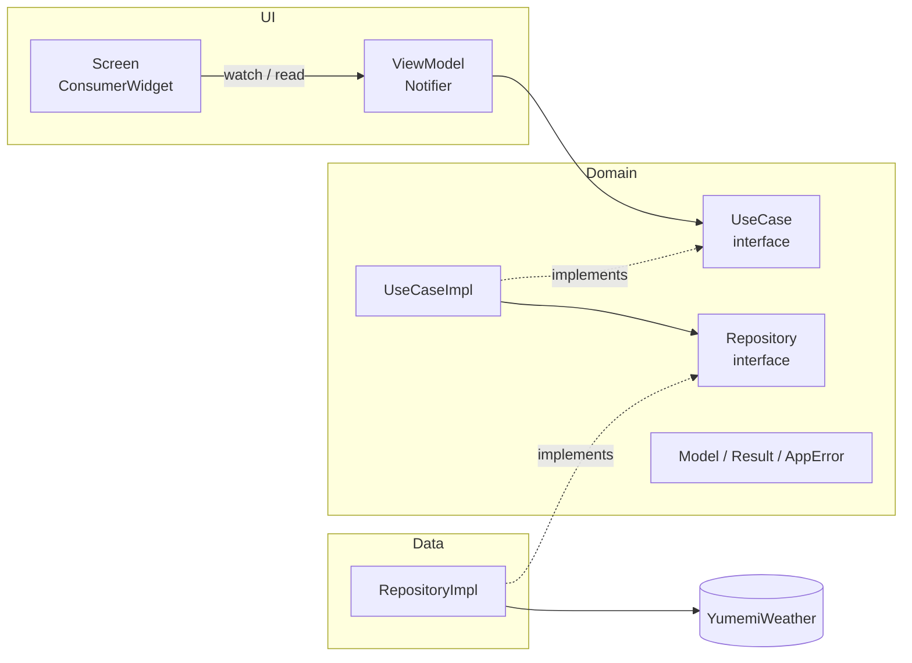
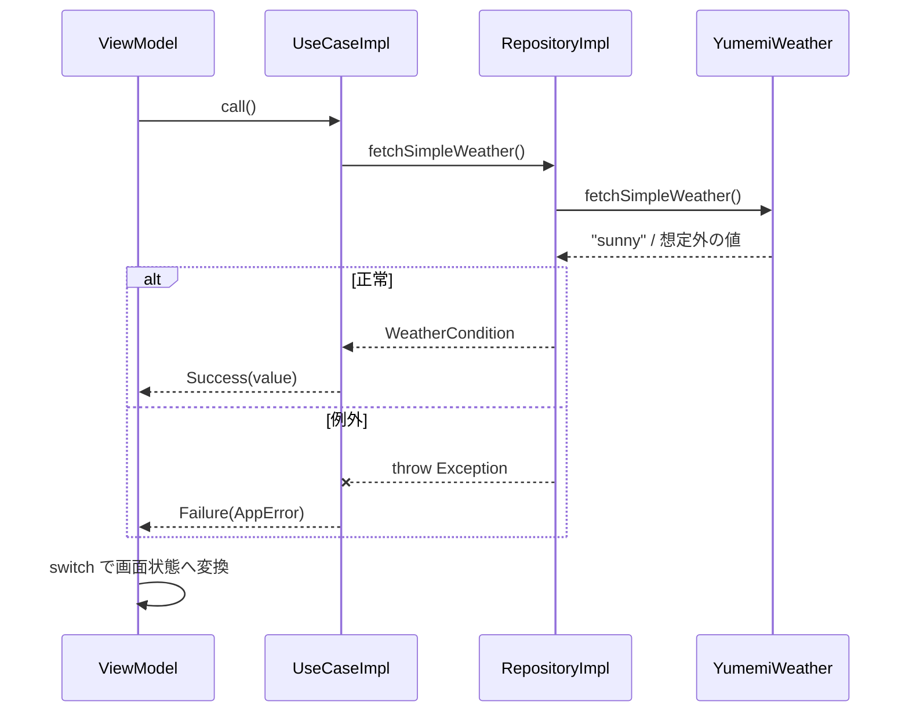

# ARCHITECTURE

本プロジェクトのアーキテクチャ（レイヤー構成・依存方向・状態管理・エラーハンドリング・テスト方針）をまとめる。新しい機能を追加するときやレビューするときは、このドキュメントに沿っているかを確認する。

## レイヤー構成



| レイヤー | 責務 | 依存してよいもの |
|----------|------|------------------|
| UI（Screen） | 状態の描画とユーザー操作の受付 | ViewModel |
| UI（ViewModel） | 画面状態の保持、UseCase の呼び出し、`Result` から画面状態への変換 | UseCase（interface 型の Provider）、Domain Model |
| Domain（UseCase） | ユースケースの実行、例外を `Result` / `AppError` に変換 | Repository（interface）、Domain Model |
| Domain（Repository interface） | データ取得の抽象 | Domain Model |
| Data（RepositoryImpl） | 外部 API の呼び出しと、レスポンスから Domain Model への変換 | 外部パッケージ、Repository（interface）、Domain Model |
| DI | 具象クラスの組み立て（Provider 定義） | 全レイヤー |

### 依存のルール

- 依存は **UI → Domain ← Data** の向きにする。Domain は UI・Data・外部パッケージ（`yumemi_weather` など）に依存しない
- ViewModel は Repository を直接参照せず、UseCase を経由する
- Screen は UseCase・Repository を直接参照しない
- 具象クラス（`XxxImpl`）を参照してよいのは DI（`lib/di/`）だけ。それ以外は interface 型で扱う

## ディレクトリ構成

```text
lib/
├── main.dart                      # ProviderScope と MaterialApp の起動のみ
├── di/                            # Provider 定義（依存の組み立て）
│   └── weather_providers.dart
├── domain/
│   ├── model/                     # 機能をまたいで使う共通モデル
│   │   ├── result.dart            # Result<T>（Success / Failure）
│   │   └── app_error.dart         # AppError（UnknownError ...）
│   └── weather/                   # 機能単位
│       ├── model/                 # Domain Model（WeatherCondition など）
│       ├── exception/             # Domain で扱う例外
│       ├── repository/            # Repository interface
│       └── usecase/               # UseCase interface と実装
├── data/
│   └── api/
│       └── weather/               # API を使う RepositoryImpl
└── ui/
    └── screen/
        ├── launch/                # 起動時の画面（StatefulWidget）
        └── weather/               # Screen と ViewModel

test/
├── domain/weather/usecase/        # UseCase のユニットテスト
├── fake/                          # 外部 API の Fake
└── helper/                        # テスト用 Matcher など
```

- 新しい機能を追加するときは `domain/<feature>/`・`data/api/<feature>/`・`ui/screen/<feature>/` の単位でディレクトリを切る
- interface は `abstract interface class` で定義し、実装クラスは `<Interface名>Impl` とする

## 状態管理と DI（Riverpod）

- `flutter_riverpod` を使い、Provider はコード生成を使わずに手書きで定義する
- Provider は `lib/di/` に置き、**interface 型で宣言**する

```dart
final weatherRepositoryProvider = Provider<WeatherRepository>(
  (ref) => WeatherRepositoryImpl(ref.watch(yumemiWeatherProvider)),
);
```

- 外部 API のクライアント（`YumemiWeather`）も Provider にして、テストで差し替えられるようにする
- ViewModel は `Notifier<State>` を継承し、`NotifierProvider` を ViewModel と同じファイルに定義する
  - 画面の状態は画面を閉じたら破棄するため、`NotifierProvider.autoDispose` で定義する
  - 初期状態は `build()` で返す
  - UseCase は `ref.read` で取得する（イベントハンドラ内で使うため）
  - ViewModel のメソッド名は UI 操作名（`reload`）ではなく、行う処理（`fetchWeather`）で命名する
- Screen は `ConsumerWidget` とし、状態は `ref.watch(xxxViewModelProvider)`、操作は `ref.read(xxxViewModelProvider.notifier).method()` で呼ぶ
  - `build` 内で直接 `ref.read` を呼ばず、`onPressed` などのコールバック内で呼ぶ
- 状態も UseCase も持たない画面（`LaunchScreen` など）は ViewModel を作らず、`StatefulWidget` で実装してよい

## 画面遷移

- 画面遷移は Screen で `Navigator` の命令型 API（`push` / `pop`）を使って行う。ViewModel では画面遷移を扱わない
- `await` の後に `BuildContext` を使うときは、先に `mounted` を確認する

## エラーハンドリング



- **RepositoryImpl は try-catch しない。** 想定外のレスポンスは Domain の例外（例: `UnknownWeatherConditionException`）として throw する
- **UseCaseImpl で try-catch し、例外を `Result` に変換する。** 例外の種類ごとに対応する `AppError` にマッピングする
  - yumemi_lints の `avoid_catches_without_on_clauses` に従い、`on` 節で型を指定して catch する
  - `Error`（プログラミングエラー）は catch しない（`avoid_catching_errors`）
- **ViewModel は `Result` を `switch` で網羅的に処理する。** `Result` と `AppError` は `sealed class` なので、新しい `AppError` を追加するとコンパイラが未処理の分岐を検出する
- 例外として throw するクラスは `Exception` を実装する（`only_throw_errors`）

### Domain の共通モデル

```dart
sealed class Result<T> { const Result(); }
final class Success<T> extends Result<T> { const Success(this.value); final T value; }
final class Failure<T> extends Result<T> { const Failure(this.error); final AppError error; }

sealed class AppError { const AppError(); }
final class UnknownError extends AppError { const UnknownError(); }
```

- エラーの種類を増やすときは `AppError` のサブクラスを追加し、UseCaseImpl のマッピングと ViewModel の分岐を更新する
- 失敗時の画面状態（例: ViewModel の状態を `null` にして `Placeholder` を表示）は ViewModel で決める。Domain Model には「未取得・失敗」を表す値（`unknown` など）を持たせない

## テスト方針

- **ユニットテストは UseCase に対して書く。** Repository は本物の `RepositoryImpl` を使い、外部 API だけを Fake に差し替える。これで UseCase と Repository の振る舞い（レスポンスの変換・例外から `Result` への変換）をまとめて保証する
- 依存の差し替えは `ProviderContainer.test(overrides: [...])` と `overrideWithValue` で行う

```dart
FetchWeatherUseCase createUseCase(YumemiWeather api) {
  final container = ProviderContainer.test(
    overrides: [yumemiWeatherProvider.overrideWithValue(api)],
  );
  return container.read(fetchWeatherUseCaseProvider);
}
```

- Fake は `flutter_test` の `Fake` を継承し、対象のクラスを `implements` する（`test/fake/`）
  - 正常系・異常系は名前付きコンストラクタ（`FakeYumemiWeather.returns` / `.throws`）で作り分ける
- `Result` の検証には `test/helper/result_matchers.dart` の `isSuccess` / `isFailure<E>` を使う
- 入力と期待値の組が複数あるケースは、`Map` と `for` でテストケースを生成する
